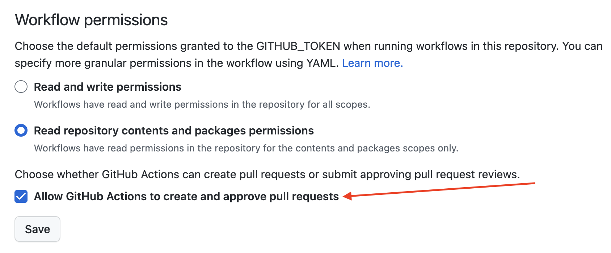

# Reusable Github Actions

Contains few reusable actions to create automatic PRs to update NodeJS & Python.

## How to use
1. Add this example configuration here into your repository in `.github/workflows/update-asdf.yml`
```yaml
name: "Update Python & Node"
description: "Updates newer Python & Node versions every morning"

on:
  schedule:
    # Every 5:30 AM in UTC
    - cron: '30 5 * * *'
  workflow_dispatch: {}

# TODO: Once dependabot supports asdf directly this should not be used anymore https://github.com/dependabot/dependabot-core/issues/1033
jobs:
  updatePython:
    name: "Update asdf Python"
    permissions:
      contents: write
      pull-requests: write
    runs-on: ubuntu-latest
    steps:
      - uses: swappiehq/github-actions/update-python@main
        with:
          version: patch # Options are: latest, minor, patch
  updateNode:
    name: "Update asdf NodeJS"
    permissions:
      contents: write
      pull-requests: write
    runs-on: ubuntu-latest
    steps:
      - uses: swappiehq/github-actions/update-nodejs@main
        with:
          version: minor # Options are: latest, lts, minor, patch
```
2. Allow Github actions to create pull requests to your repository in `Settings->Actions->Workflow Permissions`


### Approve & Enqueue PRs

> Custom Github action to approve and enqueue specific PRs based on branch name

### Get started

1. `npm i`
2. make changes in `src/`
3. `npm run build`
4. commit with both `src/` and `target/` changes

## License

[MIT](LICENSE)
